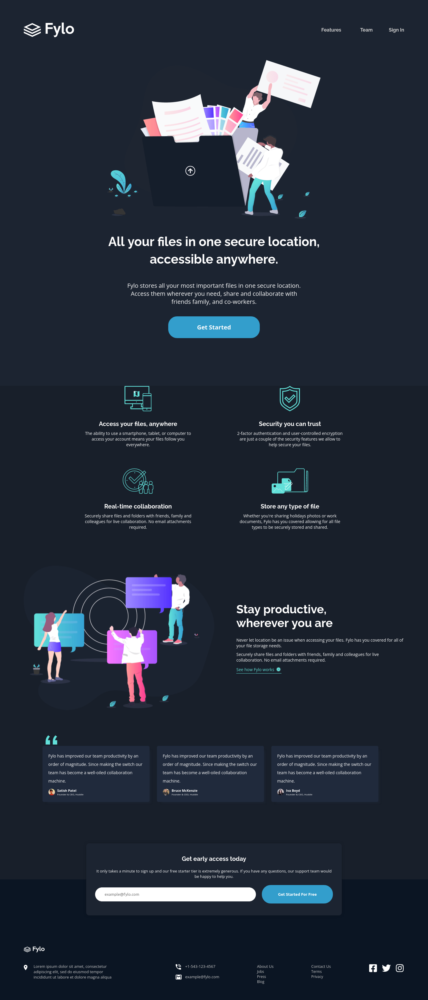

# Frontend Mentor - Fylo Dark Theme Landing Page Solution

This is a solution to the [Fylo dark theme landing page](https://www.frontendmentor.io/challenges/tip-calculator-app-ugJNGbJUX) challenge. Where Frontend Mentor challenges help you improve your coding skills by building realistic projects.

## Table of contents

- [Overview](#overview)
  - [The challenge](#the-challenge)
  - [Screenshot](#screenshot)
  - [Link](#links)
- [My process](#my-process)
  - [Built with](#built-with)
  - [What I learned](#what-i-learned)
  - [Continued development](#continued-development)
  - [Useful resources](#useful-resources)
- [Author](#author)

## Overview

This is a challenge where the main task was to create a landing page with a dark styles.

### The challenge

Users should be able to:

- View the optimal layout for the app depending on their device's screen size
- See hover states for all interactive elements on the page.

### Screenshot

- Desktop Preview:

  

- Mobile Preview:

  

### Link
- Live Site URL: [Live Site](https://jaime9611.github.io/fylo-landing-page/)

## My process

In building this project, I used Webpack to bundle all my files and to compress the images, so that the final "dist" folder will be ready for production. I also configured Webpack to compile the .scss files used for styling the page.

### Built with

- Semantic HTML5 markup
- Mobile-first workflow
- SASS
- Flexbox
- Webpack

### What I learned

Simple styling with Sass, using mixins and functions to best follow the "DRY" principle, Flexbox for layout and the use of Webpack for bundling and compilation.

### Continued development

Continue learning Sass and learn more about Webpack configuration.

### Useful resources

- [MDN](https://developer.mozilla.org/es/docs/Learn) - This helped me for reviewing CSS properties and Javascript coding.
- [W3Schools](https://www.w3schools.com/css/) - This is an useful resource for css properties and simple use cases.

## Author

- Github - [Jaime9611](https://github.com/Jaime9611)
- Frontend Mentor - [@Jaime9611](https://www.frontendmentor.io/profile/Jaime9611)
